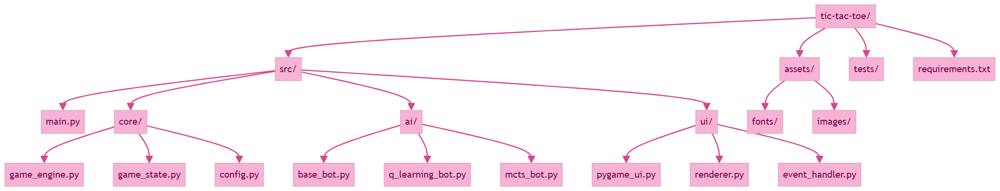
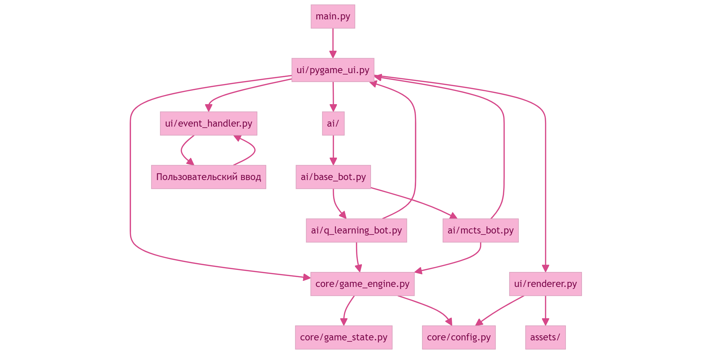

# Проект: Игра «Крестики-нолики» с Q-learning и MCTS ботами

## 1. Общее описание проекта

Проект представляет собой десктопное приложение, написанное на **Python**, реализующее игру «крестики-нолики» с:

- **переменным размером поля** (3×3, 4×4, 5×5)
- **двумя режимами игры**:
  - Игрок vs Игрок
  - Игрок vs Бот
- **двумя алгоритмами ботов**:
  - **Q-learning** (обучение с подкреплением)
  - **MCTS** (Monte Carlo Tree Search)

## 2. Что видит пользователь

### 2.1. Главное меню

Пользователь может:
- выбрать размер поля (3×3, 4×4, 5×5)
- выбрать режим:
  - «Игрок против Игрока»
  - «Игрок против Бота»
- выбрать **тип бота**:
  - Q-learning
  - MCTS
- выбрать, кто ходит первым
- нажать «Начать игру»

### 2.2. Экран игры

Показывается:
- игровое поле NxN
- индикатор текущего игрока («Ход X» / «Ход O»)
- статус игры (победа / ничья)
- кнопки:
  - «Новая игра»
  - «Назад в меню»

## 3. Требования к функционалу

### 3.1. Логика игры
- Разные размеры поля
- Корректная проверка победы, ничьи, возможных ходов

### 3.2. Бот Q-learning
- Состояние кодируется в виде строки, массива или hashable структуры
- Используются стандартные элементы RL
- Поддерживается:
  - обучение в фоне / заранее обученная таблица
  - загрузка при старте

### 3.3. Бот MCTS
- Этапы:
  - Selection — UCT
  - Expansion — добавление узлов
  - Simulation — случайная игра до терминального состояния
  - Backpropagation — обновление статистик

## 4. План задач

### 4.0. Уже реализовано

| **Задача**       | **Потратили** |
|------------------|---------------|
| Логика игры      | 2-3 ч        |
| UI               | 4-5 ч       |
| Q-learning бот   | 3-4 ч       |
| MCTS бот         | 3-4 ч       |

**Итого уже потрачено часов: ~14**

### 4.1. Требуется доделать:

#### Перепроверить Q-learning бота (3-4 часов)
- проверка корректности функции Q-обновления
- тестирование разных ε, α, γ
- поиск ошибок в кодировании состояния
- дообучение таблицы

#### Добавить выбор бота в UI (1-2 часов)
- кнопки выбора в меню
- привязка к BotManager
- тесты: смена бота работает корректно

#### Добавить тесты (3-4 часов)
- тесты логики игры
- тесты Q-learning
- тесты MCTS

#### Чистая архитектура / рефакторинг (5-7 часов)
- разделить модули по слоям, убрать лишние зависимости
- вынести интерфейсы
- унифицировать структуру проекта

**Итого ещё нужно часов: ~16**

## 5. Распределение задач в команде

### Участник 1 — архитектура + доменный слой + 1 бот
- проектирование GameState и GameEngine
- проверка структуры каталогов
- чистая архитектура
- code-review
- Q-learning: исправление игры бота

### Участник 2 — UI + 2 бот + тесты
- главное окно и меню
- выбор бота в интерфейсе
- интеграция с BotManager
- MCTS: оптимизация времени хода
- сохранение/загрузка моделей
- тестирование ИИ

## 6. Архитектура проекта

## 7. Зависимости
